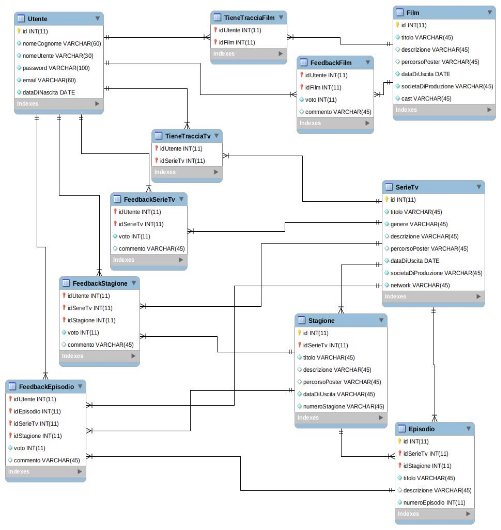

# PROGETTO DI BASI DI DATI

### AllYouWatch Santino Isgrò - X81000453 A.A. 2019/2020

INDICE

1. [Descrizione e specifiche](#Descrizione-e-specifiche)

2. [Glossario dei termini](#glossario-dei-termini)

3. [Progettazione concettuale](#progettazione-concettuale)

4. [Dizionario dei dati](#Dizionario-dati)
    - [Entità](#entità)
    - [Relazioni](#relazioni)

5. [Specifiche sulle operazioni](#specifiche-sulle-operazioni)

6. [Tavola dei volumi](#tavola-dei-volumi)

7. [Analisi delle ridondanze](#analisi-delle-ridondanze)

8. [Modello logico](#modello-logico)

9. [Schema fisico](#schema-fisico)

10. [Creazione del database](allyouwatch.sql)

11. [Implementazione operazioni](#implementazione-operazioni)

12. [Vincoli d’integrità](#vincoli-dintegrità)

## Descrizione e specifiche

Sviluppare un database per tracciare film e serie TV visti da utenti.

Gli **Utenti** sono identificati da un *id* univoco, inoltre si memorizzano nome e cognome, username, password, email e data di nascita.

I **Film** sono identificati anch’essi da un *id* univoco, vengono memorizzati anche titolo, data d’uscita, genere, durata, valutazione da 1 a 5 (con 1 scarsa e 5 eccellente), descrizione e cast.

Le **Serie tv** sono identificate da un *id* univoco, si memorizzano titolo, data d’uscita, genere, valutazione (che dipenderà dalla valutazione media di tutti gli episodi), descrizione e cast.

Gli **Episodi** sono identificati da un *id* univoco, vengono memorizzati titolo, stagione, data d’uscita, valutazione da 1 a 5 (con 1 scarsa e 5 eccellente) che andrà poi a creare la valutazione finale della serie tv.

## Glossario dei termini

| **Termine**  | **Descrizione**                                                                            | **Termini collegati**   |
| ------------ | ------------------------------------------------------------------------------------------ | ----------------------- |
| Utente       | Persona fisica registrata che può tenere traccia di film e serie tv visti.                 | Tracciamento            |
| Tracciamento | Azione fatta dall’utente una volta completata la visione di un film o episodio di serie tv | Film, SerieTv, Episodio |
| Film         | Lista dei film                                                                             |                         |
| SerieTv      | Lista delle serie tv                                                                       | Episodio                |
| Episodio     | Lista degli episodi relativi ad una serie tv                                               | SerieTv                 |

## Progettazione concettuale

- Schema scheletro

- Schema intermedio

- Schema finale 

## Dizionario dati

### Entità

|Entità|Descrizione|Attributi| Identificatore|
| ---------- | --------------------------------------------------------------------------------------- | --------------------------------------------------------------------------------------------- | ------------------ |
| Utente     | Utente registrato che tiene traccia di film/serie tv e lascia feedback relativi ad essi | Id, fullname, username, password, email, date                                                 | Id                 |
| Film       | Lista dei film                                                                          | Id, title, genre, overview, poster\_path, release\_date, production\_companies, cast, vote    | Id                 |
| Serie Tv   | Lista delle serie tv                                                                    | Id, title, genre, overview, poster\_path, release\_date, production\_companies, network, vote | Id                 |
| Stagione   | Stagioni relative alle serie tv                                                         | Id, title, overview, poster\_path, release\_date, vote, season\_number                        | Id                 |
| Episodio   | Episodi relativi relativi alle stagioni                                                 | Id, title, overview, episode\_number, crew, vote                                              | Id                 |

### Relazioni

|Relazione|Entità Partecipanti| Descrizione|Attributi|
| ------------- | ------------------------------------------ | ----------------------------------------------------------------------------------------------------- | -------------- |
| Tiene Traccia | Utente, Fim, Serie Tv                      | L’utente tiente traccia dei film e serie tv visti                                                     |                |
| Feedback      | Utente, Film, Serie Tv, Stagione, Episodio | L’utente può lasciare un feedback relativo ad un film o ad una serie tv o stagione o singolo episodio | Voto, commento |
| Appartiene    | Serie Tv, Stagione                         | Per ogni serie tv vengono elencate le stagioni appartenenti                                           |                |
| Include       | Stagione, Episodio                         | Per ogni stagione vengono elencati gli episodi inclusi                                                |                |

## Specifiche sulle operazioni

Le operazioni che si vogliono effettuare sono:

1. Registrazione di un nuovo cliente (10 al giorno)
2. Tracciamento di film e serie tv (80 al giorno)
3. Feedback su film, serie tv, stagioni ed episodi (50 al giorno)
4. Richiesta informazioni su film, serie tv, stagioni ed episodi (100 al giorno)
5. Elenco feedback di film, serie tv, stagioni ed episodi (20 al giorno)

## Tavola dei volumi

| Concetto      | Tipo | Volume  |
| ------------- | ---- | ------- |
| Utente        | E    | 25000   |
| Film          | E    | 500000  |
| Serie tv      | E    | 300000  |
| Stagione      | E    | 500000  |
| Episodio      | E    | 1000000 |
| Tiene Traccia | R    | 200000  |
| Feedback      | R    | 100000  |
| Appartiene    | R    | 500000  |
| Include       | R    | 1000000 |

## Tavola delle frequenze

| Operazione |Descrizione|Frequenza|
| ---------- | ------------------------------------------------------------- | ------------- |
| O1         | Registrazione di un nuovo cliente                             | 100 al giorno |
| O2         | Tracciamento di film e serie tv                               | 80 al giorno  |
| O3         | Feedback su film, serie tv, stagioni ed episodi               | 50 al giorno  |
| O4         | Richiesta informazioni su film, serie tv, stagioni ed episodi | 100 al giorno |
| O5         | Elenco feedback di film, serie tv, stagioni ed episodi        | 20 al giorno  |

## Analisi delle ridondanze

- L’attributo vote in Film, Serie tv, Stagione e Episodio è ridondante in quanto si può ricavare dalla media voto della relazione Feedback

- Gli attributi cast in Film, societa\_di\_prod in Film e Serie tv, network in Serie tv, crew in Episodio sono ridondanti, potrebbero esistere entità che sostituiscano ognuno di essi

### Valutazione del costo delle ridondanze

- Se vogliamo mantenere l’attributo voto in Film, questo comporta 4 byte di memoria in più. Avendo stimato in 500.000 i Film si ha 4\*500.000 = 2.000.000 byte di memoria in più. Le operazioni coinvolte sono O3 e O4, O5

- Se vogliamo mantenere l’attributo voto in Serie tv questo comporta 4 byte di memoria in più. Avendo stimato in 300.000 le Serie tv si ha 4\*300.000 = 1.200.000 byte di memoria in più. Le operazioni coinvolte sono O3, O4, O5

- Se vogliamo mantenere l’attributo voto in Stagione questo comporta 4 byte di memoria in più. Avendo stimato in 500.000 le Stagioni si ha 4\*500.000 = 2.000.000 byte di memoria in più. Le operazioni coinvolte sono O3, O4, O5
- Se vogliamo mantenere l’attributo voto in Episodio questo comporta 4 byte di memoria in più. Avendo stimato in 1.000.000 le Stagioni si ha 4\*1.000.000 = 4.000.000 byte di memoria in più. Le operazioni coinvolte sono O3, O4, O5

## Valutazione O3 con ridondanza voto su Film

| Descrizione | E/R | Accesso | Tipo |
| ----------- | --- | ------- | ---- |
| Feedback    | R   | 1       | S    |
| Film        | E   | 1       | S    |

> Considerando 1S = 2L (2*2)*50 = 200 accessi

## Valutazione O3 senza ridondanza voto su Film

| Descrizione | E/R | Accesso | Tipo |
| ----------- | --- | ------- | ---- |
| Feedback    | R   | 1       | S    |

> Considerando 1S = 2L (1*2)*50 = 100 accessi

## Valutazione O4 con ridondanza voto su Film

| Descrizione | E/R | Accesso | Tipo |
| ----------- | --- | ------- | ---- |
| Film        | E   | 1       | L    |

> Abbiamo 1*100 = 100 accessi

## Valutazione O4 senza ridondanza voto su Film

Stimiamo 50 feedback per film

| Descrizione | E/R | Accesso | Tipo |
| ----------- | --- | ------- | ---- |
| Film        | E   | 1       | L    |
| Feedback    | R   | 50      | L    |

> Abbiamo (1+50)*100 = 5100 accessi

## Valutazione O5 con ridondanza voto su Film

| Descrizione | E/R | Accesso | Tipo |
| ----------- | --- | ------- | ---- |
| Film        | E   | 1       | L    |

> Abbiamo 1*20 = 20 accessi

## Valutazione O5 senza ridondanza voto su Film

| Descrizione | E/R | Accesso | Tipo |
| ----------- | --- | ------- | ---- |
| Feedback    | R   | 1       | L    |

> Abbiamo 1*20 = 20 accessi

- Mantenendo la ridondanza abbiamo 320 accessi
- Togliendo la ridondanza abbiamo 5220 accessi

> Con la ridondanza risparmiamo 4900 accessi a fronte di 2MB memoria in più

**Conviene eliminare la ridondanza** dell’attributo voto in Film

## Valutazione O3 con ridondanza voto su Serie tv

| Descrizione | E/R | Accesso | Tipo |
| ----------- | --- | ------- | ---- |
| Feedback    | R   | 1       | S    |
| Serie tv    | E   | 1       | S    |

> Considerando 1S = 2L (2*2)*50 = 200 accessi

## Valutazione O3 senza ridondanza voto su Serie tv

| Descrizione | E/R | Accesso | Tipo |
| ----------- | --- | ------- | ---- |
| Feedback    | R   | 1       | S    |

> Considerando 1S = 2L (1*2)*50 = 100 accessi

## Valutazione O4 con ridondanza voto su Serie tv

| Descrizione | E/R | Accesso | Tipo |
| ----------- | --- | ------- | ---- |
| Serie tv    | E   | 1       | L    |

> Abbiamo 1*100 = 100 accessi

## Valutazione O4 senza ridondanza voto su Serie tv

Stimiamo 50 feedback per film

| Descrizione | E/R | Accesso | Tipo |
| ----------- | --- | ------- | ---- |
| Serie tv    | E   | 1       | L    |
| Feedback    | R   | 50      | L    |

> Abbiamo (1+50)*100 = 5100 accessi

## Valutazione O5 con ridondanza voto su Serie tv

| Descrizione | E/R | Accesso | Tipo |
| ----------- | --- | ------- | ---- |
| Serie tv    | E   | 1       | L    |

> Abbiamo 1*20 = 20 accessi

## Valutazione O5 senza ridondanza voto su Serie tv

| Descrizione | E/R | Accesso | Tipo |
| ----------- | --- | ------- | ---- |
| Feedback    | R   | 1       | L    |

> Abbiamo 1*20 = 20 accessi

- Mantenendo la ridondanza abbiamo 320 accessi
- Togliendo la ridondanza abbiamo 5220 accessi

> Con la ridondanza risparmiamo 4900 accessi a fronte di 1,2MB memoria in più

**Conviene eliminare la ridondanza** dell’attributo voto in Serie tv

## Valutazione O3 con ridondanza voto su Stagione

| Descrizione | E/R | Accesso | Tipo |
| ----------- | --- | ------- | ---- |
| Feedback    | R   | 1       | S    |
| Stagione    | E   | 1       | S    |

> Considerando 1S = 2L (2*2)*50 = 200 accessi

## Valutazione O3 senza ridondanza voto su Stagione

| Descrizione | E/R | Accesso | Tipo |
| ----------- | --- | ------- | ---- |
| Feedback    | R   | 1       | S    |

> Considerando 1S = 2L (1*2)*50 = 100 accessi

## Valutazione O4 con ridondanza voto su Stagione

| Descrizione | E/R | Accesso | Tipo |
| ----------- | --- | ------- | ---- |
| Stagione    | E   | 1       | L    |

> Abbiamo 1*100 = 100 accessi

## Valutazione O4 senza ridondanza voto su Stagione

Stimiamo 50 feedback per film

| Descrizione | E/R | Accesso | Tipo |
| ----------- | --- | ------- | ---- |
| Stagione    | E   | 1       | L    |
| Feedback    | R   | 50      | L    |

> Abbiamo (1+50)*100 = 5100 accessi

## Valutazione O5 con ridondanza voto su Stagione

| Descrizione | E/R | Accesso | Tipo |
| ----------- | --- | ------- | ---- |
| Stagione    | E   | 1       | L    |

> Abbiamo 1*20 = 20 accessi

## Valutazione O5 senza ridondanza voto su Stagione

| Descrizione | E/R | Accesso | Tipo |
| ----------- | --- | ------- | ---- |
| Feedback    | R   | 1       | L    |

> Abbiamo 1*20 = 20 accessi

- Mantenendo la ridondanza abbiamo 320 accessi
- Togliendo la ridondanza abbiamo 5220 accessi

>Con la ridondanza risparmiamo 4900 accessi a fronte di 2MB memoria in più

**Conviene eliminare la ridondanza** dell’attributo voto in Stagione

## Valutazione O3 con ridondanza voto su Episodio

| Descrizione | E/R | Accesso | Tipo |
| ----------- | --- | ------- | ---- |
| Feedback    | R   | 1       | S    |
| Episodio    | E   | 1       | S    |

> Considerando 1S = 2L (2*2)*50 = 200 accessi

## Valutazione O3 senza ridondanza voto su Episodio

| Descrizione | E/R | Accesso | Tipo |
| ----------- | --- | ------- | ---- |
| Feedback    | R   | 1       | S    |

> Considerando 1S = 2L (1*2)*50 = 100 accessi

## Valutazione O4 con ridondanza voto su Episodio

| Descrizione | E/R | Accesso | Tipo |
| ----------- | --- | ------- | ---- |
| Episodio    | E   | 1       | L    |

> Abbiamo 1*100 = 100 accessi

## Valutazione O4 senza ridondanza voto su Episodio

Stimiamo 50 feedback per film

| Descrizione | E/R | Accesso | Tipo |
| ----------- | --- | ------- | ---- |
| Episodio    | E   | 1       | L    |
| Feedback    | R   | 50      | L    |

> Abbiamo (1+50)*100 = 5100 accessi

## Valutazione O5 con ridondanza voto su Episodio

| Descrizione | E/R | Accesso | Tipo |
| ----------- | --- | ------- | ---- |
| Episodio    | E   | 1       | L    |

> Abbiamo 1*20 = 20 accessi

## Valutazione O5 senza ridondanza voto su Episodio

| Descrizione | E/R | Accesso | Tipo |
| ----------- | --- | ------- | ---- |
| Feedback    | R   | 1       | L    |

> Abbiamo 1*20 = 20 accessi

- Mantenendo la ridondanza abbiamo 320 accessi
- Togliendo la ridondanza abbiamo 5220 accessi

> Con la ridondanza risparmiamo 4900 accessi a fronte di 4MB memoria in più

**Conviene eliminare la ridondanza** dell’attributo voto in Episodio

## Modello logico

**Utente**(id, nomeCognome, nomeUtente, password, email, dataDiNascita)

**Film**(id, titolo, genere, descrizione, percorsoPoster, dataDiUscita, societaDiProduzione, cast)

**SerieTv**(id, titolo, genere	, descrizione, percorsoPoster, dataDiUscita, societaDiProduzione, network)

**Stagione**(id, idSerieTv, titolo, descrizione, percorsoPoster, dataDiUscita, numeroStagione)

**Episodio**(id, idSerieTv, idStagione, titolo, descrizione, numeroEpisodio, crew)

**TieneTracciaFilm**(idUtente, idFilm)

**TieneTracciaSerieTv**(idUtente, idTv)

**FeedbackFilm**(idUtente, idFilm, voto, commento)

**FeedbackSerieTv**(idUtente, IdSerieTv, voto, commento)

**FeedbackStagione**(idUtente, idSerieTv, idStagione, voto, commento)

**FeedbackEpisodio**(idUtente, idSerieTv, idStagione, idEpisodio, voto, commento)

## Schema fisico

## Implementazione operazioni

Operazione 1 – Registrazione di un nuovo cliente

- ``INSERT INTO Utente(nomeCognome, nomeUtente, password, email, dataDiNascita) VALUES (‘Mario Rossi’, ‘mariorossi’, ‘password12’, ‘mariorossi@email.it’, 1998-01-01’)``

Operazione 2 – Tracciamento di film e serie tv

- ``INSERT INTO TieneTracciaFim(‘idUtente’,’idFilm’) VALUES (‘1’,’1100’) INSERT INTO TieneTracciaSerieTv(‘idUtente’,’idSerieTv’) VALUES (‘1’,’1100’)``

Operazione 3 – Feedback su film / serie tv / stagioni / episodi

- ``INSERT INTO FeedbackFilm(‘idUtente’,’idFilm,’voto’) VALUES (‘1’,’1’,’5’)``

- ``INSERT INTO FeedbackSerieTv(‘idUtente’,’idSerieTv’,’voto’,’commento’) VALUES (‘1’,’1’,’5’,’Serie tv fantastica’)``

- ``INSERT INTO FeedbackStagione(‘idUtente’,’idSerieTv’,’idStagione’,’voto’) VALUES (‘1’,’2’,’1’,’3’)``
- 
- ``INSERT INTO FeedbackEpisodio(‘idUtente’,’idSerieTv’,’idStagione’,’idEpisodio’,’voto’,’commento’) VALUES (‘1’,‘1’,’1’,’10’,’5’,’Spoiler: WW muore’)``

Operazione 4 – Richiesta informazioni film / serie tv / stagioni / episodi

- ``SELECT f.*, ff.voto FROM Film f INNER JOIN (SELECT idFilm, AVG(voto) AS voto FROM FeedbackFilm GROUP BY idFilm) ff ON f.id=ff.idFilm``

- ``SELECT e.* , fe.voto FROM Episodio e INNER JOIN (SELECT idSerieTv, idStagione, idEpisodio, AVG(voto) AS voto FROM FeedbackEpisodio GROUP BY idSerieTv, idStagione, idEpisodio) fe ON e.id=fe.idStagione AND e.idSerieTv=fe.idSerieTv AND e.id=fe idEpisodio``

- ``SELECT s.*, fs.voto FROM SerieTv s INNER JOIN (SELECT idSerieTv, AVG(voto) AS voto FROM FeedbackSerieTv  GROUP BY idSerieTv) fs ON s.id=fs idSerieTv``

- ``SELECT s.*, fs.voto FROM Stagione s INNER JOIN (SELECT idSerieTv, idStagione, AVG(voto) AS voto FROM FeedbackStagione GROUP BY idSerieTv, idStagione) fs ON s.id=fs.idStagione AND s.idSerieTv=fs.idSerieTv``

Operazione 5 - Elenco feedback di film/serie tv/stagioni/episodi

- ``SELECT * FROM FeedbackFilm GROUP BY idFilm``

- ``SELECT * FROM FeedbackSerieTv GROUP BY idSerieTv``

- ``SELECT * FROM FeedbackStagione  GROUP BY idSerieTv, idStagione``

- ``SELECT * FROM FeedbackEpisodio GROUP BY idSerieTv,idStagione,idEpisodio``

## Vincoli d’integrità

1. Il voto in **FeedbackFilm**, **FeedbackSerieTv**, **FeedbackStagione**, **FeedbackEpisodio** deve essere un intero compreso tra 1 e 5
2. **Episodio** è identificato da *id*, *idSerieTv* e *idStagione*, questi ultimi due sono vincoli d’integrità referenziale
3. **FeedbackStagione** è identificato da *idUtente*, *idSerieTv*, *idStagione*, il primo chiave esterna di utente, secondo e terzo chiavi esterne di Stagione

**Vincolo 1** – voto feedback tra 1 e 5

``ALTER TABLE FeedbackFilm ADD CONSTRAINT constr_voto_fed_fil CHECK(voto BETWEEN 1 AND 5);``

``ALTER TABLE FeedbackSerieTv ADD CONSTRAINT constr_voto_fed_stv CHECK(voto BETWEEN 1 AND 5);``

``ALTER TABLE FeedbackStagione ADD CONSTRAINT constr_voto_fed_stg CHECK(voto BETWEEN 1 AND 5);``

``ALTER TABLE FeedbackEpisodio ADD CONSTRAINT constr_voto_fed_epi CHECK(voto BETWEEN 1 AND 5)``

**Vincolo 2** – idSerieTv e idStagione chiavi esterne di Episodio

``CONSTRAINT 'fk_Episodio_1' FOREIGN KEY ('idSerieTv') REFERENCES 'SerieTv' ('id') ON DELETE NO ACTION ON UPDATE NO ACTION,``

``CONSTRAINT 'fk_Episodio_2' FOREIGN KEY ('idStagione') REFERENCES 'Stagione' ('id') ON DELETE NO ACTION ON UPDATE NO ACTION``

**Vincolo 3** – idUtente, idSerieTv e idStagione chiavi esterne di FeedbackStagione

``CONSTRAINT 'fk_FeedbackStagione_1' FOREIGN KEY ('idUtente') REFERENCES 'Utente' ('id') ON DELETE NO ACTION ON UPDATE NO ACTION,``

``CONSTRAINT 'fk_FeedbackStagione_2' FOREIGN KEY ('idStagione') REFERENCES 'Stagione' ('id') ON DELETE NO ACTION ON UPDATE NO ACTION,``

``CONSTRAINT 'fk_FeedbackStagione_3' FOREIGN KEY ('idSerieTv') REFERENCES 'SerieTv' ('id') ON DELETE NO ACTION ON UPDATE NO ACTION``
